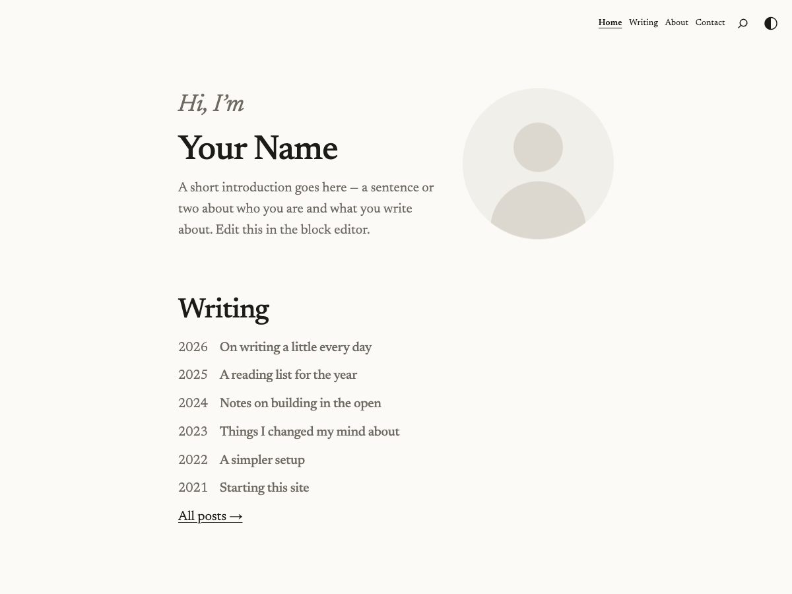

<div align="center">

# Wove

### A minimal, typographic WordPress block theme for people who write.

Elegant self-hosted serif · monochrome palette · **automatic dark mode** · reading-first.
Set it up in one click and customize everything from the dashboard — **no code**.

[](LICENSE)
[](https://wordpress.org/)
[](https://www.php.net/)
[](https://developer.wordpress.org/themes/block-themes/)
[](#contributing)
[](https://github.com/samaybhavsar/wove/stargazers)

[**Live demo → samay.io**](https://samay.io) · [Install](#install) · [Make it yours](#make-it-yours) · [Contributing](#contributing)



</div>

---

## Why Wove?

Most personal-site themes shout. **Wove gets out of the way.** It pairs a self-hosted
[Newsreader](https://fonts.google.com/specimen/Newsreader) serif with a quiet monochrome palette
and automatic light/dark, so your words are the loudest thing on the page. Under the hood it's a
modern **Full Site Editing** block theme — fast, accessible, private, and translation-ready.

- ✍️ **Reading-first** — fluid type (16→18px), comfortable measure, a calm vertical rhythm.
- 🌗 **Automatic dark mode** — follows the visitor's OS, with a one-tap header toggle and no flash of the wrong theme.
- 🔒 **Self-hosted fonts** — Newsreader ships *with* the theme. No Google Fonts, no third-party requests, GDPR-friendly.
- 🧩 **No-code, backend-driven** — one click creates your pages; set your **name, bio, photo, and links** from the dashboard.
- ♿ **Accessibility-minded** — skip link, visible focus rings, 44px touch targets, reduced-motion support, sensible heading order.
- 🔍 **Built-in SEO** — meta description, Open Graph, Twitter cards, and JSON-LD (`Person` / `BlogPosting`) — no plugin needed.
- ⚡ **Light & fast** — nearly all design lives in `theme.json`; the CSS is tiny and the primary font is preloaded.
- 🌍 **Translation-ready** — full i18n with a bundled `.pot`.
- 🆓 **Free & GPLv2** — yours to use, fork, and ship.

## Install

1. Download the latest [`wove.zip`](https://github.com/samaybhavsar/wove/releases/latest) (or run `./build.sh` to build one from source).
2. In WordPress: **Appearance → Themes → Add New → Upload Theme** → choose `wove.zip` → **Install Now** → **Activate**.
3. Click **Set up Wove** in the welcome notice. It creates your Home, Blog, About, and Contact pages, sets the static front page + posts page, and enables pretty permalinks.

> New site? On a fresh install WordPress also offers Wove's **starter content**, so the pages and menu appear automatically.

## Make it yours

Everything is editable from the dashboard — no files to touch:

| What | Where |
|---|---|
| **Your name** | **Settings → General → Site Title** (also drives the header, footer, and SEO) |
| **Greeting, bio & photo** | **Appearance → Wove → Home intro** (photo via the media library) |
| **Email & social links** | **Appearance → Wove** (feeds the footer, the Contact page, *and* your structured data) |
| **Colors, type, spacing** | **Appearance → Editor → Styles** |
| **Menu, footer, templates** | **Appearance → Editor** |

Dark mode follows each visitor's OS preference; the header **sun/moon** toggle lets them override it, and the choice is remembered.

## Requirements

- **WordPress 6.6+** (tested up to 7.0)
- **PHP 7.4+**

No build step, no dependencies, no external services at runtime.

## What's inside

```
theme.json       Design tokens, settings & styles — the core of the theme
style.css        Theme header + the few rules theme.json can't express
functions.php    Setup, the Appearance → Wove settings page, the social-links block,
                 SEO meta/JSON-LD, the dark-mode toggle, and one-click onboarding
templates/       front-page · home · single · page · archive · search · 404 · index
parts/           header · footer
patterns/        intro-hero + small translatable UI partials
assets/          Newsreader woff2 (+ OFL), placeholder portrait, favicon, theme-toggle.js
languages/       wove.pot
```

## Local development

Requires [Docker](https://www.docker.com/) + [Node](https://nodejs.org/).

```bash
npx @wordpress/env start     # WordPress at http://localhost:8888  (admin / password at /wp-admin)
npx @wordpress/env stop
```

Build a release zip (excludes dev files; ships `languages/wove.pot`):

```bash
./build.sh                   # → wove.zip
```

Regenerate the translation template after changing UI strings:

```bash
npx @wordpress/env run cli wp i18n make-pot wp-content/themes/wove wp-content/themes/wove/languages/wove.pot --domain=wove
```

## Translating

Wove is fully translation-ready. Copy `languages/wove.pot` to `languages/wove-{locale}.po`
(e.g. `wove-fr_FR.po`), translate it, compile to `.mo`, and drop both in `languages/`.
Contributions of new locales are very welcome.

## Roadmap

- 🎨 **Style variations** — alternate palettes and type pairings, switchable in one click.
- 🧱 **More block patterns** — hero variants, link-in-bio, a newsletter sign-up, project lists.
- 🖼️ A dark-mode screenshot + a short demo clip.
- 🌐 Bundled translations for common locales.

Have an idea? [Open an issue](https://github.com/samaybhavsar/wove/issues) — feedback shapes the roadmap.

## Contributing

PRs and issues are welcome! Please read [CONTRIBUTING.md](CONTRIBUTING.md). Good first contributions:
bug fixes, accessibility improvements, new translations, and block patterns. Keep the design
restrained and the CSS small — most styling belongs in `theme.json`.

## Credits

- **[Newsreader](https://github.com/productiontype/Newsreader)** by Production Type — [SIL Open Font License 1.1](assets/fonts/Newsreader-LICENSE.txt).
- Built as a [WordPress block theme](https://developer.wordpress.org/themes/block-themes/) (theme.json v3).

## License

[GPL-2.0-or-later](LICENSE). Use it, fork it, ship it.

---

<div align="center">

If Wove helps your site, a ⭐ on the repo goes a long way.

</div>
